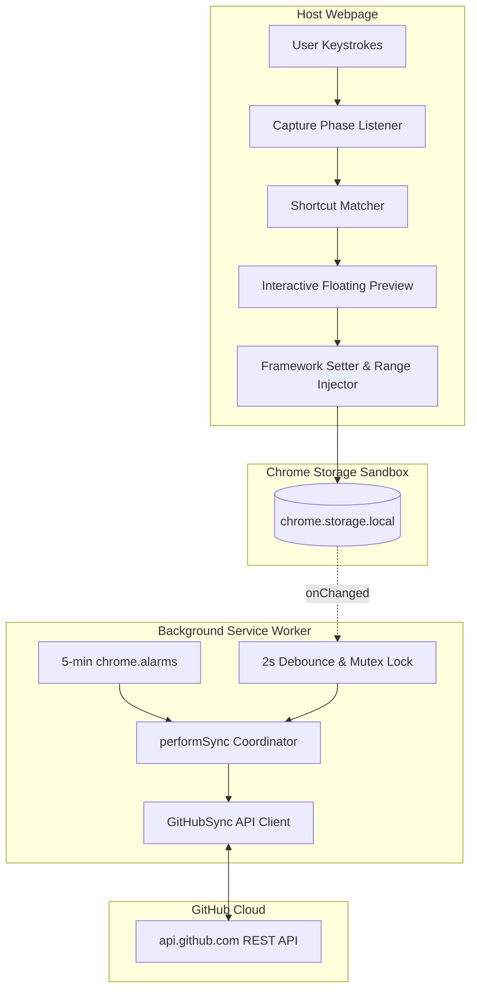

<div align="center">

# ⚡ Shortcut Helper

### *Smart Text Expansion, In-line Calculations, and Cloud Sync for Power Users*

[](https://developer.chrome.com/docs/extensions/mv3/intro/)
[](manifest.json)
[](LICENSE)
[](package.json)
[](#-security--privacy-architecture)

<p align="center">
  <b>Transform how you write on the web.</b><br>
  Expand repetitive phrases, solve live math formulas directly in any text box, generate dummy copy, and synchronize your entire productivity library across machines via your private GitHub repository—all with <b>0% idle CPU overhead</b>.
</p>

[Key Features](#-features) •
[Quick Installation](#-installation) •
[Usage Guide](#-usage-guide) •
[GitHub Sync Setup](#-github-cloud-sync-setup) •
[Architecture](#-architecture--design) •
[Security Model](#-security--privacy-architecture)

</div>

---

## 📖 Overview

**Shortcut Helper** is a lightweight, local-first browser extension engineered for developers, writers, customer support teams, and data specialists who demand rapid text expansion without privacy compromises or bloated background processes.

Unlike subscription-based snippet tools that route your keystrokes through third-party servers, **Shortcut Helper** executes entirely inside your browser sandbox. All shortcuts remain stored locally on your device in `chrome.storage.local`. When you choose to sync, data travels encrypted directly between your browser and your private GitHub repository via the official GitHub REST API.

---

## ✨ Features

### ⚡ 1. Instant Text Expansion
- Type custom slash triggers (e.g., `/email`, `/sig`, `/address`, `/meeting`) and watch them expand instantly.
- Works across **all input surfaces**: standard HTML `<input>`, `<textarea>`, dynamic content-editable regions, and rich text editors (Google Docs, Google Sheets, Slack, Gmail, Notion, WhatsApp Web, Twitter/X).
- **Modern Framework Aware**: Employs prototype descriptor property setter bindings to guarantee compatibility with React, Vue, Angular, and Svelte synthetic state managers. Expanded values never revert on subsequent keystrokes.

### 🔢 2. In-line Live Calculator
- Need quick math without breaking your writing flow? Type `/cal:` followed by any mathematical expression:
  ```text
  /cal: 45 * 12 + 150   -->   Hit [Tab] or [Enter]   -->   690
  /cal: (1800 - 350) / 4 -->   Hit [Tab] or [Enter]   -->   362.5
  ```
- **Safe & CSP Compliant**: Built with a custom AST recursive-descent parser. **Never uses `eval()` or `new Function()`**, ensuring zero CSP (Content Security Policy) violations across enterprise portals.

### 🎲 3. Dynamic Random Emoji Pools
- Define an emoji pool when creating any shortcut.
- Append a `:count` parameter to your trigger to inject randomized emojis on the fly:
  ```text
  Shortcut: /cheer  |  Emoji Pool: 🚀 🔥 ✨ 🎉 💯
  Typed:    /cheer:3
  Expanded: Awesome work! 🎉 🚀 🔥
  ```
- **Unicode Grapheme Accurate**: Powered by the modern `Intl.Segmenter` API (`granularity: 'grapheme'`). Properly handles multi-byte composite characters, skin-tone modifiers (👍🏽), country flags (🇺🇸), and Zero-Width-Joiner (ZWJ) sequences (👩‍💻, 👨‍👩‍👧‍👦) without character slicing or corruption.

### 📝 4. Instant Lorem Ipsum Generator
- Quickly generate dummy text for mockups, prototypes, and field testing:
  ```text
  /lorem:10  --> Generates exactly 10 words of classical Lorem Ipsum.
  /lorem:150 --> Generates 150 words cleanly formatted into the input.
  ```
- Hard-capped at 1,000 words to safeguard browser memory against accidental typos.

### 🔄 5. Sovereign GitHub Cloud Synchronization
- **No Third-Party Cloud**: You own your database. Synchronize your shortcuts to your personal GitHub repository.
- **Single-Source Coordinator**: Centralized synchronization in the background service worker featuring concurrency mutex locks and automatic debounced batch commits.
- **Auto-Retry on 409 Conflict**: Outdated commit SHAs are automatically reconciled with the latest remote commit SHA.

### 🏎️ 6. Zero-Overhead Performance
- **0% Idle CPU**: Replaced traditional brute-force DOM polling intervals with capture-phase event delegation.
- **Focus Guarded**: Background tabs execute **zero checks** when unfocused (`document.hasFocus()`).
- **Native Undo Preservation**: Replaces rich text via `document.execCommand('insertText')` and DOM Range selections, keeping your browser's native Undo stack (<kbd>Ctrl</kbd>+<kbd>Z</kbd> / <kbd>Cmd</kbd>+<kbd>Z</kbd>) intact.

---

## 🎯 Supported Commands & Triggers

| Command Format | Description | Example Input | Resulting Expansion |
| :--- | :--- | :--- | :--- |
| `/<trigger>` | Standard shortcut expansion | `/gh` | `https://github.com/codewithritiksaini` |
| `/<trigger>:<count>` | Shortcut expansion with random emojis | `/welcome:2` | `Welcome to the team! 🎉 🚀` |
| `/cal:<math_expression>` | Live in-line mathematical calculation | `/cal: 250 * 1.18` | `295` |
| `/lorem:<word_count>` | Dummy text generation (1 - 1000 words) | `/lorem:5` | `Lorem ipsum dolor sit amet` |

---

## 📥 Installation

### Method A: Load Unpacked (Developer Mode)

Works on any Chromium-based browser (**Google Chrome**, **Brave**, **Microsoft Edge**, **Arc**, **Opera**):

1. **Clone or Download** this repository:
   ```bash
   git clone https://github.com/codewithritiksaini/shortcuts-chrome-extension.git
   ```
2. Open your browser and navigate to the Extensions management page:
   - Chrome: `chrome://extensions`
   - Brave: `brave://extensions`
   - Edge: `edge://extensions`
3. Toggle on **Developer mode** (usually located in the top-right corner).
4. Click the **Load unpacked** button in the top-left toolbar.
5. Select the `shortcuts-chrome-extension` root folder (the folder containing `manifest.json`).
6. Pin **Shortcut Helper** to your browser toolbar for quick access!

---

## 🔗 GitHub Cloud Sync Setup

Shortcut Helper allows you to store your shortcuts in any GitHub repository (private or public) for backup and multi-device sync.

```
┌─────────────────────────┐          GitHub REST API          ┌─────────────────────────┐
│     Browser Device      │ ◄──────────────────────────────►  │    GitHub Repository    │
│  (chrome.storage.local) │    (Direct Encrypted HTTPS API)   │   (your-shortcuts.json) │
└─────────────────────────┘                                   └─────────────────────────┘
```

### Step 1: Create a Personal Access Token (PAT)
1. Navigate to **[GitHub Settings → Developer Settings → Personal Access Tokens](https://github.com/settings/tokens)**.
2. Select **Fine-grained personal access tokens** (Recommended for security) or **Tokens (classic)**:
   - **Repository Access**: Select *Only select repositories* → choose your shortcuts repository.
   - **Repository Permissions**: Set **Contents** to `Read and write`.
3. Generate and copy your token (e.g. `github_pat_...` or `ghp_...`).

### Step 2: Connect Shortcut Helper
1. Click the **Shortcut Helper** icon in your browser toolbar.
2. Click the **🔗 (GitHub Sync)** icon in the header.
3. Provide:
   - **Email Address**: Your profile identifier (e.g. `user@example.com`).
   - **Repository**: Your target repository in `username/repo-name` format.
   - **Personal Access Token**: Paste your token generated in Step 1.
   - **Auto-Sync**: Check to automatically push changes and sync every 5 minutes.
4. Click **Connect**. Shortcut Helper will test the connection, pull any existing shortcuts, and link your browser.

---

## 🏗️ Architecture & Design

Shortcut Helper follows a clean, decoupled architecture optimized for the Chrome Manifest V3 lifecycle:



### Key Architectural Highlights
- **Isomorphic `GitHubSync`**: The sync engine ([github-sync.js](github-sync.js)) is designed as a standalone, zero-dependency ES6 module that runs identically inside service workers and window scopes.
- **Single-Writer Lock**: Background worker maintains an in-memory execution mutex (`isSyncing`) to eliminate double-write race conditions and 409 SHA conflicts.
- **Framework Compatibility Layer**: Solves the notorious React Controlled Component issue where programmatic value assignments get overwritten by React's internal fiber state.

---

## 🔒 Security & Privacy Architecture

| Principle | Implementation |
| :--- | :--- |
| **No Third-Party Intermediaries** | All network requests communicate **only** with `https://api.github.com`. Zero telemetry, zero external trackers, zero advertising SDKs. |
| **Least Privilege Permissions** | Requests solely `"storage"` and `"alarms"` permissions. Network access is tightly scoped to `https://api.github.com/*`. |
| **No Eval / Strict CSP** | Calculator uses deterministic syntactic expression parsing. Never parses dynamic code strings via `eval()` or `Function()`. |
| **XSS Sanitization** | All preview elements and tooltip text are mounted via native `textContent` DOM nodes and pre-wrap layout engines, preventing arbitrary HTML or script injection from imported shortcuts. |
| **Local Storage Isolation** | All credentials and shortcuts reside strictly within your browser's sandboxed local storage partition (`chrome.storage.local`). |

---

## 📂 Repository Structure

```text
shortcuts-chrome-extension/
├── .github/
│   └── workflows/
│       └── update.yml         # CI/CD deployment workflow for self-hosted distribution
├── icons/
│   ├── icon16.png             # Extension toolbar icon (16x16)
│   ├── icon48.png             # Extension management icon (48x48)
│   └── icon128.png            # Web Store / Display icon (128x128)
├── extension/
│   ├── shortcuts-chrome-extention.crx # Compiled self-hosted distribution package
│   └── updates/
│       └── update.xml         # Auto-update manifest for self-hosted deployment
├── .gitignore                 # Standard repository exclusion rules
├── background.js              # Manifest V3 background service worker (sync orchestrator)
├── content.js                 # Content script: DOM input interceptor & preview renderer
├── github-sync.js             # Standalone GitHub REST API client (push, pull, merge)
├── LICENSE                    # MIT open-source license
├── manifest.json              # Extension metadata and Manifest V3 configuration
├── popup.html                 # Extension popup interface
├── popup.js                   # Popup UI controller, shortcut editor, and sync actions
├── README.md                  # Project documentation
└── styles.css                 # Premium custom stylesheet for extension UI
```

---

## ⌨️ Keyboard Shortcuts & Shortcuts Guide

| Key / Action | Context | Function |
| :--- | :--- | :--- |
| <kbd>Tab</kbd> | Preview Tooltip Open | Instantly expands the matched shortcut or calculated value |
| <kbd>Enter</kbd> | Preview Tooltip Open | Instantly expands the matched shortcut or calculated value |
| <kbd>Escape</kbd> | Preview Tooltip Open | Dismisses the preview tooltip |
| **Click** | Preview Tooltip | Inserts the text into the active field |
| **Copy Button** | Preview Tooltip | Copies expanded result directly to system clipboard |

---

## 🧪 Development & Quality Assurance

To verify code syntax and integrity before committing:

```bash
# Verify JavaScript syntax across all modules
node -c content.js
node -c background.js
node -c popup.js
node -c github-sync.js

# Validate Manifest JSON schema
node -e "JSON.parse(require('fs').readFileSync('manifest.json'))"
```

---

## 👨‍💻 Author

**Ritik Saini**
- Website: [ritiksaini.in](https://ritiksaini.in)
- Extension Portal: [shortcut-helper.ritiksaini.in](https://shortcut-helper.ritiksaini.in)
- GitHub: [@codewithritiksaini](https://github.com/codewithritiksaini)

---

## 📄 License

This project is licensed under the **MIT License** — see the [LICENSE](LICENSE) file for details.
Open source and built for the community with ❤️.
